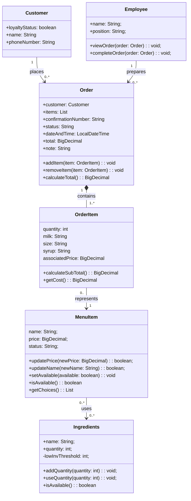

# Class Model — Group 2
### ICS372 | Fall 2026
**Members:** Thomas Yang, Abenezer Aregay, Elijah Allotey, Houreratou Bande
**Last updated:** 10/9/2026 — Diagram

---

## 1 · The Diagram

---

## 2 · The Classes

### Customer

**Responsibility:** Responsible for storing customer information and loyalty status.

**Traces to:** Customer

**Kind:** Concrete class - Represents a customer with their own information and loyalty status.

**Fields:** loyaltyStatus: boolean | name: String | phoneNumber: String

**Methods:** No method currently defined.

### Order

**Responsibility:** Responsible for managing the state and contents of a customer's order

**Traces to:** Order

**Kind:** Concrete class - Represents an individual order placed by a customer

**Fields:** customer: Customer | items: List<OrderItem> | confirmationNumber: String | status: String | dateAndTime: LocalDateTime | total: BigDecimal | note: String

**Methods:** addItem(item: OrderItem): void - adds an item to the order | removeItem(item: OrderItem): void - removes an item from the order | calculateTotal(): BigDecimal - calculates the total cost of the order.

### OrderItem

**Responsibility:** Responsible for storing the details, customizations, and associated price of a menu item within an order

**Traces to:** OrderItem

**Kind:** Concrete class - Represents a menu item configured for a specific order, including its selected options and quantity

**Fields:** quantity: int | milk: String | size: String | syrup: String | associatedPrice: BigDecimal

**Methods:** calculateSubTotal(): BigDecimal - calculates the subtotal for this order item based on its associated price and quantity | getCost(): BigDecimal - returns the associated price of the configured item

### MenuItem

**Responsibility:** Responsible for storing and managing the information and availability of a menu item

**Traces to:** MenuItem

**Kind:** Concrete class - Represents a specific item offered on the coffee shop's menu

**Fields:** name: String | price: BigDecimal | status: String

**Methods:** updatePrice(newPrice: BigDecimal): boolean - updates the item's menu price | updateName(newName: String): boolean - updates the item's name | setAvailable(available: boolean): void - changes whether the item is available | isAvailable(): boolean - returns whether the item is available for purchase | getChoices(): List<String> - returns the ingredients used by the item 

### Ingredients

**Responsibility:** Responsible for storing and managing the ingredient inventory information

**Traces to:** Ingredients

**Kind:** Concrete class - Represents an ingredient whose quantity can be tracked and updated

**Fields:** name: String | quantity: int | lowInvThreshold: int

**Methods:** addQuantity(amount: int): void - increases the available quantity when inventory is restocked | useQuantity(amount: int): void - decreases the available quantity when inventory is used | isAvailable(): boolean - checks whether the ingredient has stock available

### Employee

**Responsibility:** Responsible for completing customer orders

**Traces to:** Employee

**Kind:** Concrete class - Represents an employee who interacts with orders

**Fields:** name: String | position: String

**Methods:** viewOrder(order: Order): void - allows the employee to view an order's details | completeOrder(order: Order): void - marks an order as completed

---

## 3 · The Mapping

**Domain entity to class:**

| Domain entity | Becomes | Why |
|---|---|---|
| Customer | Customer | Stores customer information and loyalty status |
| Order| Order | Represents an order and manages its content, status, and total |
| OrderItem | OrderItem | Stores the quantity, customizations, and associated price of an item within an order |
| MenuItem | MenuItem | Represents a product offered on the menu, including its current price and availability |
| Ingredients | Ingredients | Tracks ingredient quantities and availability |
| Employee | Employee | Represents an employee who views and completes orders |

**Classes with no domain entity behind them:**

| Class | Technical reason |
|---|---|
| None Currently | All classes in the design traces to an domain entity |

**Domain entities that became no class at all:**

| Entity | Where it went instead |
|---|---|
| None | All domain entities have a corresponding class |

---

## 4 · Decisions Worth Defending

### Storing the associated price in OrderItem

**What we did:** We gave OrderItem an associatedPrice field to store the price of the configured item in that specific order. MenuItem will retain the current menu price, while OrderItem perserves the price associated with the order item

**What we chose against:** We chose not to rely only on the MenuItem's price when determining the price of an existing order item

**Why:** The menu price and the associated price serve different purposes. Keeping associated price on OrderItem allows the order item to keep its own price rather than depending on later menu price changes

**What would change our minds:** If certain requirements like existing orders must always use the latest menu price were to show up then we would need to reconsider how and when OrderItem's associated price is updated.
