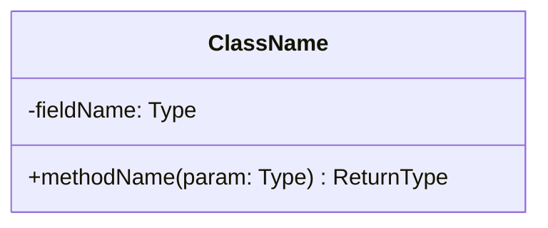

# Class Model — [Group Name / Number]
### [Course Name] | [Semester]
**Members:** [All member names]
**Last updated:** [Date] — [what changed]

---

*This file lives at `docs/design/class-model.md` and begins in Week 6. It is a **living document**.*

*This is the solution, not the problem. Everything the domain model refuses is allowed here: interfaces, abstract classes, method signatures, visibility, and types that answer to nothing in the business at all.*

*The mapping from `domain-model.md` is deliberately not one to one. One domain entity can become one class, several, or none — a seasonal drink is real in the business and is data in the design. Some classes trace to no domain entity whatsoever.*

*The rule that keeps this document honest: **every class traces to something.** Either an entity in the domain model, or a stated technical reason. A class that traces to neither is one you have not justified.*

*Delete every italic instruction and every bracketed placeholder before you commit.*

---

## 1 · The Diagram

*One Mermaid class diagram. Interfaces, abstract classes, concrete classes, fields, method signatures, relationships with multiplicity.*

---

## 2 · The Classes

*One entry per class. Repeat this block.*

### [ClassName]

**Responsibility:** [One sentence. If you cannot state it in one sentence, the class is doing too much.]

**Traces to:** [A domain entity by name, **or** a technical reason — "nothing in the business; this exists to read the JSON file at startup."]

**Kind:** [concrete class / abstract class / interface] — [and one line on why this kind and not another]

**Fields:** [name and type]

**Methods:** [signature and one line on what each does]

---

## 3 · The Mapping

*The audit that keeps this file connected to the domain model. Re-run it whenever either document changes.*

**Domain entity to class:**

| Domain entity | Becomes | Why |
|---|---|---|
| [entity] | [one class / several classes / no class, it is data on X] | [what drove the decision] |

**Classes with no domain entity behind them:**

| Class | Technical reason |
|---|---|
| [ClassName] | [what it exists for] |

**Domain entities that became no class at all:**

| Entity | Where it went instead |
|---|---|
| [entity] | [e.g. an attribute on another class, a value, a configuration] |

*Every domain entity must appear in one of the tables above. An entity that quietly disappeared between the two documents is the failure this audit exists to catch.*

---

## 4 · Decisions Worth Defending

*The choices someone could reasonably have made differently. Interface versus abstract class, where a responsibility landed, what you chose not to share.*

### [The decision]

**What we did:** [one or two sentences]

**What we chose against:** [the real alternative, stated fairly]

**Why:** [what actually drove it — not "it seemed cleaner"]

**What would change our minds:** [the requirement or discovery that would make the other choice right]
