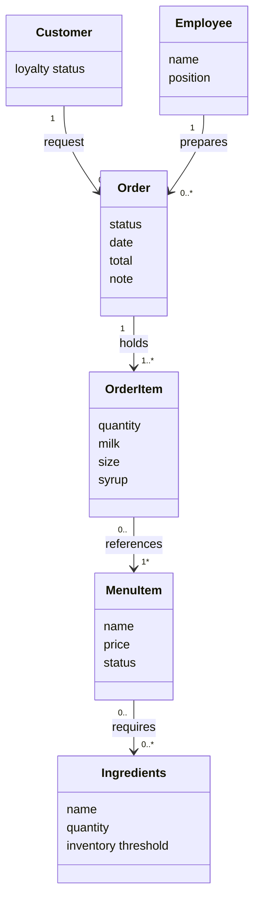

# Domain Model — Group 2
### ICS372 | Fall 2026
**Members:** Thomas, Elijah, Abenezer, Ray
**Last updated:** 9/16/2026 - Added Attributes

---

## The Diagram

---

## The Entities

| Entity | What it is |
|---|---|
| Customer | A person who orders items at the coffee shop |
| Order | A customers request for items |
| OrderItem | The quantity of an item and its customization |
| MenuItem | An item customers can order from |
| Ingredients | An item used to make menu items and keep track of inventory |
| Employee | A person who works at the coffee shop and interacts with orders or other systems |

---

## Rules This Document Follows

*Keep this section. It is what you check against before every commit.*

- **The paper test.** Every entity here would exist if the business ran on an order pad and a shoebox of receipts. Screens, controllers, stores and persistence are real and necessary; they belong in the class model, not here.
- **Objects, not types.** No supertype invented so code can treat several things alike. A distinction the owner herself makes is a fact about the business and may stay; machinery introduced to carry it may not.
- **No behavior.** Not as a method, not as a sentence in the description. The description says what the entity *is*. Where behavior lives is a design question and it belongs in the class model.
- **Every relationship has a verb and multiplicity on both ends.** An unlabelled line is not a relationship.
- **A relationship that has to know something is an entity.** If a quantity, a customization, a price at the time, or a who-and-when belongs to the pairing rather than to either end, name it and draw two relationships instead of one.
