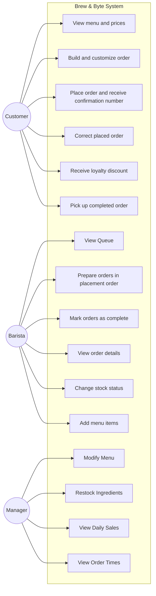

# Use Cases — Group 2
### ICS372 | Fall 2026
**Members:** Thomas, Elijah, Abenezer, Ray
**Last updated:** 9/16/2026 — Fixed Use Case Diagram

---

## 1 · The Use Case Diagram

---

## 2 · All Use Cases

### Customer

- **UC-C1 View menu and prices** — The customers looks at available menu items and how much they cost | req 2.1

- **UC-C2 Build and Customize Order** — The customer can add items, customize those items, remove/add them, order multiple, and add notes | req 2.1, 2.2, 2.3, 2.4, 2.6

- **UC-C3 Place Order and receive confirmation number** — The customer places the order and receives a confirmation number | req 2.5

- **UC-C4 Correct Placed Order** — The customer can fix their order after placing it |  req 2.7

- **UC-C5 Receive Loyalty Discount** — After signing up for the loyalty program they can receive discounts |  req 2.8

- **UC-C6 Pick up completed order** — The customer picks up their order when it is marked ready by the barista |  inferred req 3.3

### Barista

- **UC-B1 View Queue** — The barista views orders that need to be done |  req 3.1

- **UC-B2 Prepare Orders in placement order** — The barista prepares orders in the order they were placed by the customers  |  req 3.2

- **UC-B3 Mark Orders as Complete** — The barista marks orders complete when it is ready to be picked up |  req 3.3

- **UC-B4 View Order Details** — The barista views details, customizations, and notes about the order |  req 3.5

- **UC-B5 Change Stock Status** — The barista can tell the system if something is unavailable |  req 3.6

- **UC-B6 Add Menu Items** — The barista will be able to add menu items when a manager is not present |  req 3.7

### Manager

- **UC-M1 Modify Menu** — The manager will be able to add menu items, configure things like prices and remove items |  req 4.1, 4.2

- **UC-M2 Restock Ingredients** — The manager updates ingredient availablity when supply comes in |  req 4.3

- **UC-M3 View Daily Sales** — The manager can view what was sold and how much revenue was made |  req 4.5

- **UC-M4 View Order Times** — The manager can view how long orders are taking |  req 4.6

---

## 3 · Detailed Use Cases

*Repeat this block for each use case that needs full detail.*

*The flow is written as a conversation between the actor and the system: the actor does something, the system responds, the actor does the next thing. Steps are numbered continuously down the table, alternating between the columns. Only one column has content in any given row.*

*Write the system's side as what the system does, not how it does it. "The system shows the items currently available" is a system response. "The system queries the menu table and populates the list view" is implementation.*

*The alternative flows are where the design lives. The main flow is the easy part and is where nothing interesting ever happens — if you cannot think of a single thing that could go wrong, you have not thought about it yet. To find them, walk the main flow and ask at every step what that step assumes, then ask what happens when the assumption is false.*

*An alternative flow branches from a step in the flow. Something that happens out in the world — a carton turns out to be empty, a machine breaks — is not an alternative flow. It reaches the system as an actor doing something, which makes it a use case of its own, or it does not reach the system at all.*

---

### [UC-ID] [Use Case Name]

**Actor:** [primary actor] *[and any secondary actors]*

**Precondition:** [what must be true before this can begin]

**Postcondition:** [what is true afterward that was not true before]

**Main flow**

| Actor Action | System Response |
|---|---|
| 1. [The actor does something.] | |
| | 2. [The system responds.] |
| 3. [The actor does the next thing.] | |
| | 4. [The system responds.] |
| | 5. [And so on, until the postcondition holds.] |

**Alternative flows**

*Each one is keyed to the step in the main flow where it branches. Say where it rejoins, or that it ends the use case.*

**[A1] At step 3 — [what is different this time]**

| Actor Action | System Response |
|---|---|
| 3a. [What the actor does instead.] | |
| | 3b. [How the system responds.] |

*Rejoins the main flow at step 4.* [or: *Ends here; the postcondition does not hold.*]

**[A2] At step [N] — [what goes wrong]**

| Actor Action | System Response |
|---|---|
| | [N]a. [What the system does about it.] |

*[Where it goes.]*

**Assumptions:** [Anything you decided that the requirements did not decide. Cross-reference the entry in `open-questions.md`.]

---

## 4 · Non-Functional Requirements

| # | Requirement | What kind | How we would know we met it |
|---|---|---|---|
| 1.2 | The system should be fast and easy to use without extensive training required | Usability/Performance | The response needed from the system and specific training requirements would need to be informed |
| 1.3 | Information should never be lost and be usable or recoverable after a power outage | Reliability | The system should be able to preserve information and restore any of it when needed, but exact recovery requirements are unclear |
| 1.4 | A recently placed order should appear on a barista's tablet immediately | Performance | The delay between order placed and appearing on the tablet needs to be defined |

---

## 5 · Coverage Against the Domain Model

| Use case | Entities it needs | Covered? |
|---|---|---|
| UC-C1 View Menu and Prices | MenuItem | Yes |
| UC-C2 Build and Customize Order | Order, OrderItem, MenuItem | Yes |
| UC-C3 Place Order and Receive Confirmation Number | Order | Yes |
| UC-C4 Correct Placed Order | Order, OrderItem | Yes |
| UC-C5 Receive Loyalty Discount | Customer, Order | Yes |
| UC-C6 Pick Up Completed Order | Order | Yes |
| UC-B1 View Queue | Order, OrderItem | Yes |
| UC-B2 Prepare Order in Placement Order | Order | Yes |
| UC-B3 Mark Orders as Complete | Order | Yes |
| UC-B4 View Order Details | Order, OrderItem, MenuItem | Yes |
| UC-B5 Change Stock Status | MenuItem, Ingredients | Yes |
| UC-B6 Add Menu Items | MenuItem | Yes |
| UC-M1 Modify Menu | MenuItem | Yes |
| UC-M2 Restock Ingredients | Ingredients | Yes |
| UC-M3 View Daily Sales | Order | Yes |
| UC-M4 View Order Times | Order | Yes |

