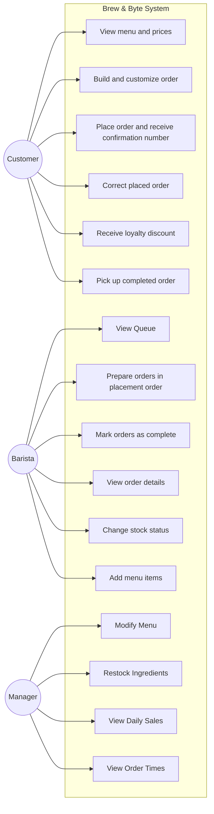

# Use Cases — Group 2
### ICS372 | Fall 2026
**Members:** Thomas, Elijah, Abenezer, Ray
**Last updated:** 9/16/2026 — Fixed Use Case Diagram

---

## 1 · The Use Case Diagram

---

## 2 · All Use Cases

### Customer

- **UC-C1 View menu and prices** — The customers looks at available menu items and how much they cost | req 2.1

- **UC-C2 Build and Customize Order** — The customer can add items, customize those items, remove/add them, order multiple, and add notes | req 2.1, 2.2, 2.3, 2.4, 2.6

- **UC-C3 Place Order and receive confirmation number** — The customer places the order and receives a confirmation number | req 2.5

- **UC-C4 Correct Placed Order** — The customer can fix their order after placing it |  req 2.7

- **UC-C5 Receive Loyalty Discount** — After signing up for the loyalty program they can receive discounts |  req 2.8

- **UC-C6 Pick up completed order** — The customer picks up their order when it is marked ready by the barista |  inferred req 3.3

### Barista

- **UC-B1 View Queue** — The barista views orders that need to be done |  req 3.1

- **UC-B2 Prepare Orders in placement order** — The barista prepares orders in the order they were placed by the customers  |  req 3.2

- **UC-B3 Mark Orders as Complete** — The barista marks orders complete when it is ready to be picked up |  req 3.3

- **UC-B4 View Order Details** — The barista views details, customizations, and notes about the order |  req 3.5

- **UC-B5 Change Stock Status** — The barista can tell the system if something is unavailable |  req 3.6

- **UC-B6 Add Menu Items** — The barista will be able to add menu items when a manager is not present |  req 3.7

### Manager

- **UC-M1 Modify Menu** — The manager will be able to add menu items, configure things like prices and remove items |  req 4.1, 4.2

- **UC-M2 Restock Ingredients** — The manager updates ingredient availablity when supply comes in |  req 4.3

- **UC-M3 View Daily Sales** — The manager can view what was sold and how much revenue was made |  req 4.5

- **UC-M4 View Order Times** — The manager can view how long orders are taking |  req 4.6

---

## 3 · Detailed Use Cases

### UC-C2 Build and Customize Order

**Actor:** Customer

**Precondition:** System must be ready to accept orders

**Postcondition:** Order must go to employee to make it

**Main flow**

| Actor Action | System Response |
|---|---|
| 1. Customer starts order| |
| | 2. Creates a updatable temporary order and tracks stock |
| 3. Customer updates the order | |
| | 4. continues to keep track |
| 5. customer pays for order | |
| | 6. order sent to queue for employees |

**Alternative flows**

**A1 At step 3 — item in menu becomes unavailable **

| Actor Action | System Response |
|---|---|
| 3a. Must select a different item | |
| | 3b. update order and not use out-of-stock item |

Rejoins step 3

**A2 At step 5 — payment failure**

| Actor Action | System Response |
|---|---|
| | 5a. does not send the order to the queue. Ask again for payment |

Can be the end of the process or be sent depending on payment acceptance

**Assumptions:** N/A

## 4 · Non-Functional Requirements

| # | Requirement | What kind | How we would know we met it |
|---|---|---|---|
| 1.2 | The system should be fast and easy to use without extensive training required | Usability/Performance | The response needed from the system and specific training requirements would need to be informed |
| 1.3 | Information should never be lost and be usable or recoverable after a power outage | Reliability | The system should be able to preserve information and restore any of it when needed, but exact recovery requirements are unclear |
| 1.4 | A recently placed order should appear on a barista's tablet immediately | Performance | The delay between order placed and appearing on the tablet needs to be defined |

---

## 5 · Coverage Against the Domain Model

| Use case | Entities it needs | Covered? |
|---|---|---|
| UC-C1 View Menu and Prices | MenuItem | Yes |
| UC-C2 Build and Customize Order | Order, OrderItem, MenuItem | Yes |
| UC-C3 Place Order and Receive Confirmation Number | Order | Yes |
| UC-C4 Correct Placed Order | Order, OrderItem | Yes |
| UC-C5 Receive Loyalty Discount | Customer, Order | Yes |
| UC-C6 Pick Up Completed Order | Order | Yes |
| UC-B1 View Queue | Order, OrderItem | Yes |
| UC-B2 Prepare Order in Placement Order | Order | Yes |
| UC-B3 Mark Orders as Complete | Order | Yes |
| UC-B4 View Order Details | Order, OrderItem, MenuItem | Yes |
| UC-B5 Change Stock Status | MenuItem, Ingredients | Yes |
| UC-B6 Add Menu Items | MenuItem | Yes |
| UC-M1 Modify Menu | MenuItem | Yes |
| UC-M2 Restock Ingredients | Ingredients | Yes |
| UC-M3 View Daily Sales | Order | Yes |
| UC-M4 View Order Times | Order | Yes |

