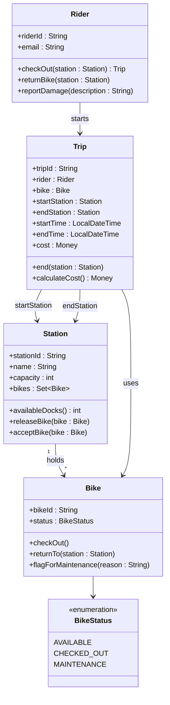

# Group Artifact — Week 2
**Group 4: Nair, Okonkwo, Chen, Rivera | September 3, 2026**

> **Tonight's problem:** A city is launching a bike-share network. Riders use an app to check out bikes from stations and return them to any station in the network. Trips are billed by duration. Bikes can be reported as damaged mid-ride. Identify the domain objects, their state and behavior, and sketch how they relate.

---

## Class Diagram

---

## Key Decisions

### Trip is its own object

Two of us started with Trip as a method on Rider — log a start time, return the bike, done. We converged on a standalone Trip object for three reasons:

1. **Identity.** Trip #88134 is a persistent record. It exists after the ride ends for billing and history. A method call doesn't persist.
2. **Lifecycle.** A Trip has states: started → in progress → ended. `calculateCost()` runs when it ends, not when it starts. State across time is an object, not a method.
3. **endStation is not known at checkout.** The Trip holds open state — startStation is set on creation, endStation is set on return. A method can't carry that.

### Station holds Bikes; Bike does not track its location

We debated two models:
- Bike knows its `currentStation`
- Station knows its Bikes

We chose Station holds Bikes. Location is a property of the station's inventory, not of the bike's identity. Bike #447 is the same bike regardless of where it is; what changes is the station's dock manifest. The exception: while checked out, a bike belongs to an active Trip, not any station. `BikeStatus.CHECKED_OUT` handles this without forcing Bike to hold a nullable station reference that would need to be nulled out on checkout and re-set on return.

### Dock is deferred

Marcus modeled Dock as a full class — each dock has an ID, a status (functional/jammed/empty), and a reference to its Station. The argument: a station with 20 docks and 13 bikes shows 7 open docks, but if all 7 are jammed, no one can return a bike there. That's a real operational scenario that a capacity integer can't represent.

We deferred it anyway. The problem statement doesn't mention dock-level tracking. None of our core use cases — check out, return, report damage — require knowing which specific dock a bike is in. Modeling Dock now adds complexity to every Station operation without yielding behavior we need this week. We recorded the decision here explicitly; we're not pretending the question doesn't exist.

### Damage reporting stays outside this diagram

When a rider reports damage, Bike gets flagged (`status → MAINTENANCE`) and the trip ends. We did not model a MaintenanceRequest class this week — it's implied by `flagForMaintenance(reason)` but not shown. Intentional scope control.

---

## Open Questions

- **Who creates a Trip?** `Rider.checkOut(station)` returns one, which means something inside that method constructs the object. We left this open — it's a Week 7 question.
- **Zone-based pricing?** We assumed duration-only cost. If pricing depends on which stations the trip crosses (a common real-world model), `calculateCost()` already has access to `startStation` and `endStation`, so the method can be extended without restructuring. We noted this but did not model it.
