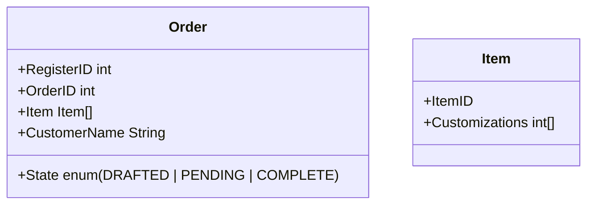

# Group Artifact — Week 2 Round 1
**Group:** 2
**Members present:** Ray, Elijah, Thomas, Abenezer
**Date:** September 3, 2026

---

## Our Design

*Describe what your group decided. Be specific enough that someone who wasn't in the room could understand the design without asking follow-up questions.*

Our group agreed on 4 parts, a register, an order view, an inventory view, and an order entity.

The register would provide the capability of drafting new order entities, while also staying updated with the inventory set, and legal customizations provided by management. The order view would have a queue of orders sent by valid submissions created by the register, and it would allow employees to complete orders and remove them from the order queue. The inventory panel would allow management to update the offered items by the register and each items allowed configurations. Throughout the lifecycle of an order, each system that it would interact with would change its state from the options (DRAFTED | PENDING | COMPLETE | FAILED), depending on the outcome of the order. 

---

## Diagram

---

## How We Got Here

*What did the problem require? What did you look at first? Walk through the reasoning that led to your design — not just what you decided, but why.*

The problem required the formation of different entities to facilitate a coffee shop. We first looked at the main structures of the coffee shop and what entities we would agree on with that. We looked at it from the lens of how orders would move through the system and how they would be created, which led us to crystalizing the structure of the register, and the order view, with the inventory view controlling the set of possible orders through the register. we decided this because the ultimate goal of the coffee shop is to facilitate the creation of orders. 

---

## Where We Disagreed

*Did any group members have a different approach? Describe the disagreement and how you resolved it. If everyone agreed immediately, say so — but think carefully first.*

Something we all agreed upon was the general 3 entity structure of the Order view, Inventory view, and register. Since our individual sketches included all those structures already it seemed like we were on the same page for the overall structure. 

Some of the group members had the idea of including an employee entity for interaction with the register, at first I disagreed because I felt as though there should be a separation between the users and the actual system that they might use, however my group members argued that it could be useful for archival purposes and in further thought, for future permissions and tips it could be useful. 

---

## What We're Not Sure About

*What might be wrong about this design? What could break later? What are you choosing to leave unresolved for now?*

We have some concerns about whether or not the orderID is enough to differentiate between orders, and whether or not we should include an employee entity. Were leaving the specifics of a customerID for later as we would like to see if we can expand upon the order queue and what other information we might end up needing later on. 
