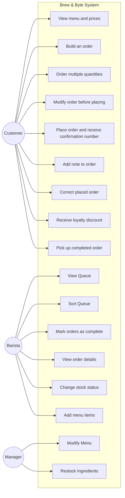

# Group Artifact — Week 3 Round 2
**Group:** 2
**Members present:** Ray, Elijah, Thomas, Abenezer
**Date:** September 10, 2026

---

## Our Design

---

## Our Deliverable

|Use case|Actor|Requirement|Where it came from|
|---|---|---|---|
|View Queue|Barista|3.1|This req. requires the barista to see placed orders|
|Sort Queue|Barista|3.2|This req. requires the barista to have an ordered queue|
|Mark orders as complete|Barista|3.3|This req. requires the barista to mark orders as complete|
|View order details|Barista|3.5|This req. requires the barista to have the ability to see greater order details|
|Change stock status|Barista|3.6|This req. requires the barista to alert for out of stock items|
|Add menu items|Barista|3.7|This req. requires the barista to have the ability to add menu items|
|Modify menu|Manager|4.1|only the manager is allowed to modify the menu|
|Restock ingredients|Manager|4.3|manager can restock ingredients|
|View menu and prices|Customer|2.1|It says a customer can look at the menu and see what available and how much it cost|
|Build an order|Customer|2.2|It says the customer can build an order by adding items and selecting options like size and milk|
|Order multiple quantities|Customer|2.3|It says a customer can order more than one of the same drink|
|Modify orders before placing|Customer|2.4|It says the customer can remove an item or change it before finishing their order|
|Place orders and receiving confirmation number|Customer|2.5|It says that when a customer is done they can place the order then receive a confirmation number|
|Add notes to order|Customer|2.6|It says the customer can add notes to the order to specify certain details|
|Correct Placed orders|Customer|2.7|It says the customer should be able to fix their orders after its been sent|
|Receive Loyalty discount|Customer|2.8|It says loyalty members should have discounts automatically applied|
|Pick up completed order|Customer|3.3|It could be inferred that this is a use case since in 3.3 it states an order is ready to be picked up.|

---

## Unused Functional Requirements

Barista did not use: 
3.4

Manager did not use: 
4.4, 4.5, 4.6

Customer did not use: 
N/A

