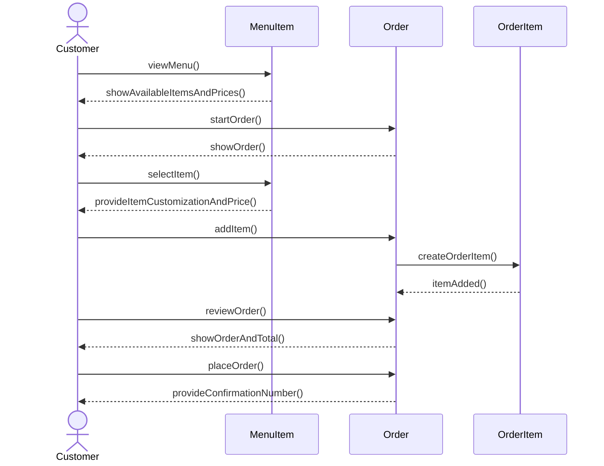

# Group Artifact — Week 4 Round 2
**Group:** 2
**Members present:** Thomas, Elijah, Abenezer, Ray
**Date:** 09-17-26

---

## 1. Tonight's Prompt

### 1
One sequence diagram for Customer Places Order, from the use case's numbered steps. Every message your model cannot answer goes on a list, sorted into one of two: an entity you are missing, or machinery that has no counterpart in the business at all. The second kind goes to open-questions.md for Week 6. Nothing gets a class tonight.

### 2
Part B (15 min) — the price change, and the repair.

Agree on what your model says Sam paid, and why. Then fix it, and be precise about what the fix is: what entities exist now that did not, what each knows, what the relationship between them is, and which one holds the price.

### 3

State the two jobs explicitly, one sentence each: what is the thing on the menu, and what is the thing in the order? They are different things with different lifetimes. The menu's version changes whenever the owner says so. The order's version must never change again once the order is placed.

 

### 4

Then sweep the rest of your model for the same shape. At every entity ask: is there a moment where the general thing changes and the particular thing must not?

## 2. How We Got Here

 

---

## 3. Where We Disagreed

---

## 4. What We're Not Sure About
Most of us had some trouble making our diagrams or fully understanding what was asked of us. We struggled to come to meaningful conclusions from the questions and our own sequence diagrams. 

