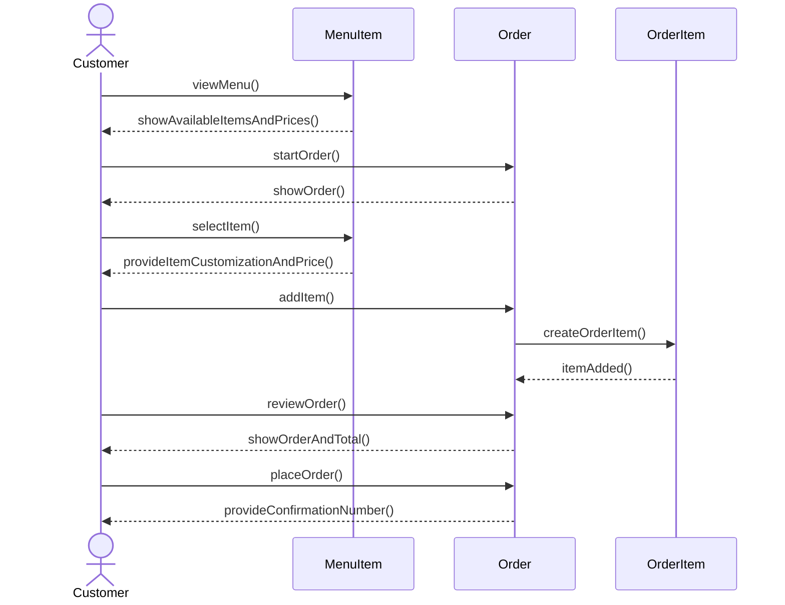

# Group Artifact — Week 4 Round 2
**Group:** 2
**Members present:** Thomas, Elijah, Abenezer, Ray
**Date:** 09-17-26

---

## 1. Tonight's Prompt

### Part A
One sequence diagram for Customer Places Order, from the use case's numbered steps. Every message your model cannot answer goes on a list, sorted into one of two: an entity you are missing, or machinery that has no counterpart in the business at all. The second kind goes to open-questions.md for Week 6. Nothing gets a class tonight.

Missing entity: None

Missing machineary: Calculating the total for the order isn't represented as a business entity

### Part B (Price Change and Repair)

As of right now the model will not reliably tell what Sam paid if the menu price changes. The price is stored on MenuItem and OrderItem points to MenuItem. If the price of MenuItem is changed, the model won't be able to preserve Sam's original order price.

The fix would be to store the price at the time it was ordered inside OrderItem. MenuItem would display the offers on the menu while OrderItem would be the item plus the price that applied when it was added.

The relationship would be that an order could hold multiple OrderItems and OrderItems can represent the same MenuItem. So the MenuItem would hold the current menu price and OrderItem would hold the price at the time of the order.

### Part B (Two Jobs)

MenuItem: What the coffee shop is currently offering with its price and availablity.

OrderItem: A specific menu item that was added to an order including the associated price.

### Part B (Sweep)

| Entity | Is there a moment where the general thing changes and the particular thing must not? | Reason | |
|---|---|---|---|
| MenuItem | Yes | Price can change but an existing OrderItem needs the original price |
| Ingredient | Unsure | Stock will change but we're not sure if theres a requirement needing orders to preserve anything from ingredients |
| Customer | Unsure | Loyalty discount could change after an order but needing to preserve order discount is undecided |
| Order | Yes | The order changes while being built but is fixed after submitted if we use requirement 3.4 |
| OrderItem | Yes | Price should be preserved when a order is placed |

## 2. How We Got Here

 

---

## 3. Where We Disagreed

---

## 4. What We're Not Sure About
Most of us had some trouble making our diagrams or fully understanding what was asked of us.

