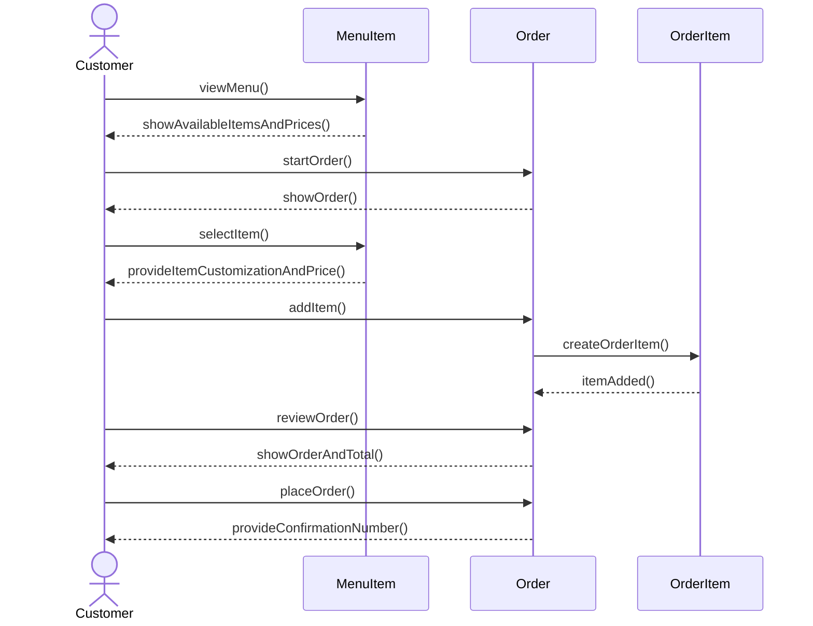

# Group Artifact — Week 4 Round 2
**Group:** 2
**Members present:** Thomas, Elijah, Abenezer, Ray
**Date:** 09-17-26

---

## 1. Tonight's Prompt
Design a main flow and use that to create a Customer Places Order sequence diagram. Identify any hidden or created problems with the sequence diagram.

### Part A

Missing entity: None

Missing machineary: Calculating the total for the order isn't represented as a business entity

### Part B (Price Change and Repair)

As of right now the model will not reliably tell what Sam paid if the menu price changes. The price is stored on MenuItem and OrderItem points to MenuItem. If the price of MenuItem is changed, the model won't be able to preserve Sam's original order price.

The fix would be to store the price at the time it was ordered inside OrderItem. MenuItem would display the offers on the menu while OrderItem would be the item plus the price that applied when it was added.

The relationship would be that an order could hold multiple OrderItems and OrderItems can represent the same MenuItem. So the MenuItem would hold the current menu price and OrderItem would hold the price at the time of the order.

### Part B (Two Jobs)

MenuItem: What the coffee shop is currently offering with its price and availablity.

OrderItem: A specific menu item that was added to an order including the associated price.

### Part B (Sweep)

| Entity | Is there a moment where the general thing changes and the particular thing must not? | Reason | |
|---|---|---|---|
| MenuItem | Yes | Price can change but an existing OrderItem needs the original price |
| Ingredient | Unsure | Stock will change but we're not sure if theres a requirement needing orders to preserve anything from ingredients |
| Customer | Unsure | Loyalty discount could change after an order but needing to preserve order discount is undecided |
| Order | Yes | The order changes while being built but is fixed after submitted if we use requirement 3.4 |
| OrderItem | Yes | Price should be preserved when a order is placed |

## 2. How We Got Here

We used what we deemed the most accurate sequence diagram within our group and used that as the basis for the following questions. An extra entity was not needed since only information was needed and that alone wouldn't warrant a new entity. We did identify a missing machinery and that was how would the system calculate the total and since it wasn't identified as a business entity in our domain model we thought it fit. Looking over the sequence diagram we realized that if OrderItem used MenuItems there wouldn't be any clear way to tell what a customer paid for their order. A fix we came up with was using OrderItem to preserve or hold the price that came from that specific order. This would allow prices to change while being able to see the correct prices for older orders.
 

---

## 3. Where We Disagreed

---

## 4. What We're Not Sure About
Most of us had some trouble making our diagrams or fully understanding what was asked of us.

