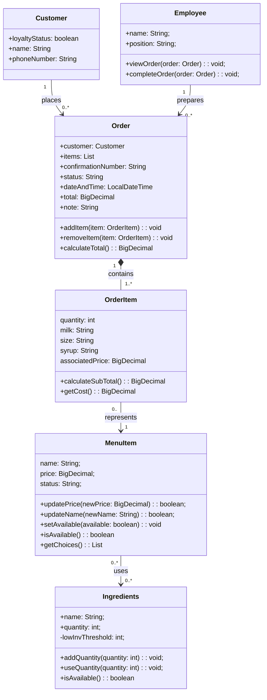

# Group Artifact — Week 6 
**Group:** 2
**Members present:** Elijah Allotey, Thomas Yang, Abenezer Aregay, Houreratou Bande
**Date:** 10/1/26

---

## 1. Tonight's Prompt

Build one class model for the group. Your sketches will disagree; that's what the first ten minutes are for. Copy the four steps below into section 1 of docs/week-06/group-artifact.md and put each deliverable under the step that asked for it.


## Group Build (30 min, then 20 more after the checkpoint)

### Step 1: The group mapping table. Same four columns as your sketches, one row per entity in domain-model.md, none skipped.


| Entity | Verdict | Becomes | If no class, where it went |
|---|---|---|---|
| Customer | one class | Customer | - | 
| Order | one class | Order | - | 
| OrderItem | one class | OrderItem | - | 
| MenuItem | one class | MenuItem | - | 
| Ingredients | one class | Ingredients | - | 
| Employee | one class | Employee | - | 


### Step 2: The class diagram. One Mermaid classDiagram block with your whole model. Syntax is in docs/resources/mermaid-cheatsheet.md. It's finished when all four are true:




### Step 3: The responsibility and trace list. One line per class in the diagram, in exactly this shape:

- **Employee**: Responsible for completing orders, and managing employee state. Traces to Employee.
- **Customer**: Responsible for knowing loyalty status. Traces to Customer.
- **OrderItem**: Responsible for knowing a particular part of an order. Traces to Order
- **Order**: Responsible for handling the current state of an order. Traces to Order
- **MenuItem**: Responsible for handling the state of a particular menu item. Traces to MenuItem
- **Ingredients**: Responsible for: containing the state of ingredients. Traces to Ingredients


### Step 4: Your hierarchy statement. One of these, completed:

We decided to not use hierarchy or interface because our domain model didn't have a strong is a relationship or shared behaviors that required inheritance. The differences in our classes is represented through their existing responsibilities and relationships. A possible interfaces if we needed to have one was implementing <abstract class> <Item> because our classes OrderItem and MenuItem both share similar methods like setPrice, their attributes can be collapsed to make them more similar aswell which would also be a benefit to using an abstract class like Item.

---

## Group Redesign (30 min)

**Three things, in this order:**

1. **Re-cut the hierarchy** along the two axes from the regroup: *configurable vs. fixed*, and *assembled from ingredients vs. stocked as whole units*. If you keep a tree, one sentence on what it buys you. If you drop it, say what replaced it.
2. **Run the four questions** against the new version. Each one needs a class and a method behind it.
3. **Sweep your own diagram** and fix any other place you split things by what they *are* rather than by what *varies*.

**Not tonight:** how the customer view gets hold of the Menu in the first place. Put it in `open-questions.md` for a later session and leave it alone.

**The four questions** (still posted):

**Q1.** What does it cost, as this customer has configured it? \
**Q2.** What choices does it offer, and what are the options for each? \
**Q3.** Can it be sold right now? \
**Q4.** What does it consume when it is sold?

**Same file, second commit.** Don't start a new file or delete the first version's work. Edit the step 1 table and the step 2 diagram in place, and put everything new under this heading at the very end of section 1:


### After the regroup


**1. Re-cut the hierarchy** in your step 2 diagram. If a class disappeared, its entity still needs a destination, so fix its row in the step 1 table too.

**2. Answer the four questions** under `### After the regroup`, in exactly these columns:

```
| Question | Class and method that answers it | Type the caller holds |
|---|---|---|
| Q1 cost as configured | OrderItem.getCost(): BigDecimal| OrderItem|
| Q2 choices offered | MenuItem.getChoices(): List<String>| MenuItem |
| Q3 can it be sold now | MenuItem.isAvailable(): boolean| MenuItem |
| Q4 what it consumes | MenuItem.getIngredients(): List<Ingredients> | MenuItem |
```

A filled row looks like `Member.currentHolds(): List<Hold>` in the middle column and `Member` on the right: the method that answers, and what the calling code's variable is declared as. If a row has no answer, write `NOT ANSWERED` and put the reason in section 4.

**3. Sweep the rest of the diagram.** One line per place you split classes by what something *is* rather than by what *varies*:

```
- Found: nothing else

```

Write `- Found: nothing else` if you looked and found nothing. Looking and finding nothing is a result; not looking isn't.

**4. Finish the model.** Read this aloud against the new diagram and check every item. This is the version Week 7 compiles.

- [ ] Step 1: every entity has a row, and every row has one of the three verdicts.
- [ ] Step 2: every class has at least one attribute written `name: type`, or a note saying it deliberately has none.
- [ ] Step 2: every method is written `name(parameters): returnType`. No bare names, no bodies.
- [ ] Step 2: every line uses `<|--`, `*--`, `o--` or `-->`.
- [ ] Step 2: every line has multiplicity in quotes on **both** ends.
- [ ] Step 3: every class has `Responsible for:` and `Traces to:` filled in.
- [ ] Step 4: your hierarchy sentence is rewritten for the new diagram.

**5. What changed.** Two or three sentences: what the diagram looked like before the regroup, what it looks like now, and why. If your first version already held up, say what you did and when you decided it.

We needed to add some new methods and redo some of existing methods to solve Q1-Q4. There was also a idea around a IngredientRequirement class to represent how much of each ingredient a menuItem uses.

**6. `docs/design/open-questions.md`:** anything you chose not to settle, each with a target week.

---

## 2. How We Got Here

*What did the problem require? What did you look at first? Walk through the reasoning that led to what you produced, not just what you decided but why. This section carries more weight than any other, because the deciding is the part being graded.*

[Your response here]

---

## 3. Where We Disagreed

*Did any group members have a different approach? Name the disagreement, give both positions, and say how you resolved it or that you are deliberately leaving it open. If everyone agreed immediately, say so, but think carefully first: name the decision that could most plausibly have gone the other way and say why it did not.*

[Your response here]


---

## 4. What We're Not Sure About

*What might be wrong about this? What could break later? What are you choosing to leave unresolved for now, and why is it safe to defer?*

[Your response here]
