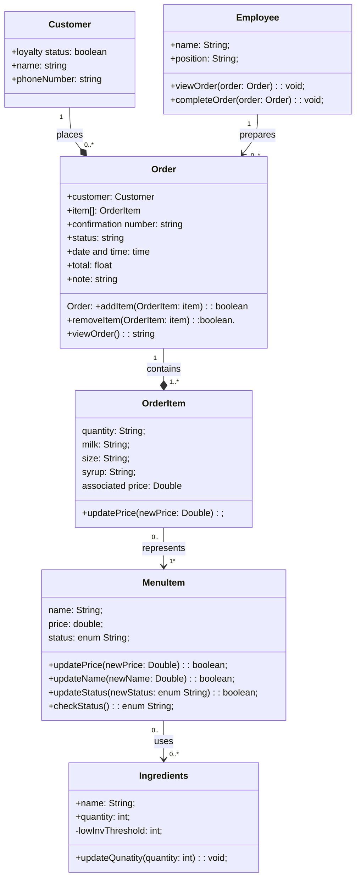

# Group Artifact — Week 6 
**Group:** 2
**Members present:** Elijah Allotey, Thomas Yang, Abenezer Aregay, Houreratou Bande
**Date:** 10/1/26

*Delete every italic instruction and every bracketed placeholder before you commit. The artifact should read as a document, not as a form with answers inserted.*

---

## 1. Tonight's Prompt

*Copy this round's group prompt into this section exactly as it was given to you, including every part and every numbered item. Then produce each deliverable directly underneath the part that asked for it.*

*Every deliverable the prompt names gets produced. A deliverable you ran out of time on gets one line saying where you got to. Commit what you have rather than nothing.*

*Where the prompt asks for a diagram or a table, it goes under the part that asked for it. Every diagram is a Mermaid code block inside this file. Never an image, never a screenshot, never a link.*

## Group Build (30 min, then 20 more after the checkpoint)

Build one class model for the group. Your sketches will disagree; that's what the first ten minutes are for. Copy the four steps below into section 1 of docs/week-06/group-artifact.md and put each deliverable under the step that asked for it.

About the examples. They use the textbook's library system and show only the shape of an answer.

Step 1: The group mapping table. Same four columns as your sketches, one row per entity in domain-model.md, none skipped.

Verdict is one class, several classes, or no class. Where your sketches disagreed, record the group's verdict here and the disagreement itself in section 3.

| Entity | Verdict | Becomes | If no class, where it went |
|---|---|---|---|
| Customer | one class | Customer | - | 
| Order | one class | Order | - | 
| OrderItem | one class | OrderItem | - | 
| MenuItem | one class | OrderItem | - | 
| Ingredients | one class | Ingredients | - | 
| Employee | one class | Employee | - | 

Step 2: The class diagram. One Mermaid classDiagram block with your whole model. Syntax is in docs/resources/mermaid-cheatsheet.md. It's finished when all four are true:

Every attribute has a type: +memberId: String, not +memberId.
Every method has parameters and a return type: +placeHold(itemId: String): Hold. Signatures only.
Every relationship uses the arrow for its kind: <|-- inheritance, *-- composition, o-- aggregation, --> plain association.
Every relationship has multiplicity on both ends, in quotes: Library "1" *-- "0..*" Member.

Step 3: The responsibility and trace list. One line per class in the diagram, in exactly this shape:

- **Employee**: Responsible for completing orders, and managing employee state. Traces to Employee.
- **Customer**: Responsible for knowing loyalty status. Traces to Customer.
- **OrderItem**: Responsible for knowing a particular part of an order. Traces to Order
- **Order**: Responsible for handling the current state of an order. Traces to Order
- **MenuItem**: Responsible for handling the state of a particular menu item. Traces to MenuItem
- **Ingredients**: Responsible for: containing the state of ingredients. Traces to Ingredients

Step 4: Your hierarchy statement. One of these, completed:

We used <abstract class | interface> <Name> because <what it buys us>. One sentence per hierarchy or interface.
We used no hierarchy and no interface because <why not>.
Either is fine. Not having thought about it is not.

Push as you go, not just at the end. Before the break, read this checklist aloud in your room and check every item:

Step 1: every entity has a row, and every row has one of the three verdicts.
Step 2: every class has at least one attribute written name: type, or a note saying it deliberately has none.
Step 2: every method is written name(parameters): returnType. No bare names, no bodies.
Step 2: every line uses <|--, *--, o-- or -->.
Step 2: every line has multiplicity in quotes on both ends.
Step 3: every class has Responsible for: and Traces to: filled in.
Step 4: your hierarchy sentence is written.
A class with attributes and no methods can be deliberate or an oversight. If deliberate, write Does: nothing, deliberate, because <reason> on its step 3 line. Anything you can't settle goes in docs/design/open-questions.md with a target week, not as a guess on the diagram.

Commit before the break: docs/week-06/group-artifact.md, steps 1 to 4 done and sections 2 to 4 of the template filled in.

We used no hierarchy and no interface because our domain model does not currently have it, but these are the interfaces were thinking of possibly implementing <abstract class> <Item> because our classes OrderItem and MenuItem both share similar methods like setPrice, their attributes can be collapsed to make them more similar aswell which would also be a benefit to using an abstract class like Item. 

---

## 2. How We Got Here

*What did the problem require? What did you look at first? Walk through the reasoning that led to what you produced, not just what you decided but why. This section carries more weight than any other, because the deciding is the part being graded.*

[Your response here]

---

## 3. Where We Disagreed

*Did any group members have a different approach? Name the disagreement, give both positions, and say how you resolved it or that you are deliberately leaving it open. If everyone agreed immediately, say so, but think carefully first: name the decision that could most plausibly have gone the other way and say why it did not.*

[Your response here]

---

## 4. What We're Not Sure About

*What might be wrong about this? What could break later? What are you choosing to leave unresolved for now, and why is it safe to defer?*

[Your response here]
