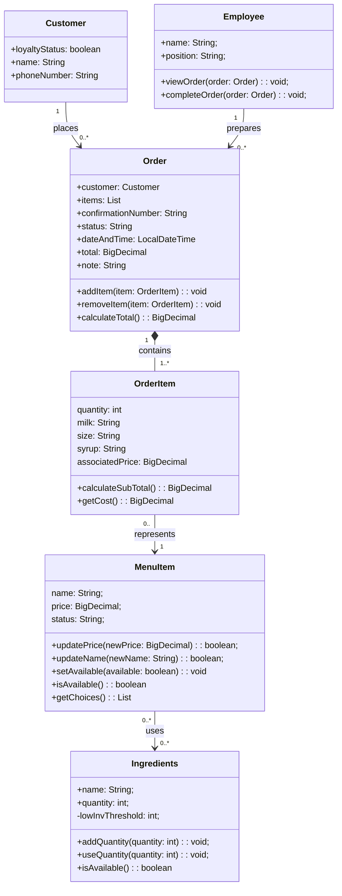

# Group Artifact — Week 6 
**Group:** 2
**Members present:** Elijah Allotey, Thomas Yang, Abenezer Aregay, Houreratou Bande
**Date:** 10/1/26

---

## 1. Tonight's Prompt

Build one class model for the group. Your sketches will disagree; that's what the first ten minutes are for. Copy the four steps below into section 1 of docs/week-06/group-artifact.md and put each deliverable under the step that asked for it.


## Group Build (30 min, then 20 more after the checkpoint)

### Step 1: The group mapping table. Same four columns as your sketches, one row per entity in domain-model.md, none skipped.


| Entity | Verdict | Becomes | If no class, where it went |
|---|---|---|---|
| Customer | one class | Customer | - | 
| Order | one class | Order | - | 
| OrderItem | one class | OrderItem | - | 
| MenuItem | one class | MenuItem | - | 
| Ingredients | one class | Ingredients | - | 
| Employee | one class | Employee | - | 


### Step 2: The class diagram. One Mermaid classDiagram block with your whole model. Syntax is in docs/resources/mermaid-cheatsheet.md. It's finished when all four are true:




### Step 3: The responsibility and trace list. One line per class in the diagram, in exactly this shape:

- **Employee**: Responsible for completing orders, and managing employee state. Traces to Employee.
- **Customer**: Responsible for knowing loyalty status. Traces to Customer.
- **OrderItem**: Responsible for knowing a particular part of an order. Traces to Order
- **Order**: Responsible for handling the current state of an order. Traces to Order
- **MenuItem**: Responsible for handling the state of a particular menu item. Traces to MenuItem
- **Ingredients**: Responsible for: containing the state of ingredients. Traces to Ingredients


### Step 4: Your hierarchy statement. One of these, completed:

We decided to not use hierarchy or interface because our domain model didn't have a strong is a relationship or shared behaviors that required inheritance. The differences in our classes is represented through their existing responsibilities and relationships. A possible interfaces if we needed to have one was implementing <abstract class> <Item> because our classes OrderItem and MenuItem both share similar methods like setPrice, their attributes can be collapsed to make them more similar aswell which would also be a benefit to using an abstract class like Item.

---

## Group Redesign (30 min)

**Three things, in this order:**

1. **Re-cut the hierarchy** along the two axes from the regroup: *configurable vs. fixed*, and *assembled from ingredients vs. stocked as whole units*. If you keep a tree, one sentence on what it buys you. If you drop it, say what replaced it.
2. **Run the four questions** against the new version. Each one needs a class and a method behind it.
3. **Sweep your own diagram** and fix any other place you split things by what they *are* rather than by what *varies*.

**Not tonight:** how the customer view gets hold of the Menu in the first place. Put it in `open-questions.md` for a later session and leave it alone.

**The four questions** (still posted):

**Q1.** What does it cost, as this customer has configured it? \
**Q2.** What choices does it offer, and what are the options for each? \
**Q3.** Can it be sold right now? \
**Q4.** What does it consume when it is sold?

**Same file, second commit.** Don't start a new file or delete the first version's work. Edit the step 1 table and the step 2 diagram in place, and put everything new under this heading at the very end of section 1:


## After the regroup


### **1. Re-cut the hierarchy** in your step 2 diagram. If a class disappeared, its entity still needs a destination, so fix its row in the step 1 table too.

We considered hierarchy using the two axes, but in the end decided against it. This is because our existing classes and the relationships they represent meet all the current requirements without the need to create subclasses. Only configurable drinks assembled from ingredients seem to be sold at the coffee shop so adding other types would mean creating classes for things that the requirements have not established a use for.

### **2. Answer the four questions** under `### After the regroup`, in exactly these columns:

```
| Question | Class and method that answers it | Type the caller holds |
|---|---|---|
| Q1 cost as configured | OrderItem.getCost(): BigDecimal| OrderItem|
| Q2 choices offered | MenuItem.getChoices(): List<String>| MenuItem |
| Q3 can it be sold now | MenuItem.isAvailable(): boolean| MenuItem |
| Q4 what it consumes | MenuItem.getIngredients(): List<Ingredients> | MenuItem |
```

A filled row looks like `Member.currentHolds(): List<Hold>` in the middle column and `Member` on the right: the method that answers, and what the calling code's variable is declared as. If a row has no answer, write `NOT ANSWERED` and put the reason in section 4.

### **3. Sweep the rest of the diagram.** One line per place you split classes by what something *is* rather than by what *varies*:

```
- Found: nothing else

```

Write `- Found: nothing else` if you looked and found nothing. Looking and finding nothing is a result; not looking isn't.

### **4. Finish the model.** Read this aloud against the new diagram and check every item. This is the version Week 7 compiles.

- [ ] Step 1: every entity has a row, and every row has one of the three verdicts.
- [ ] Step 2: every class has at least one attribute written `name: type`, or a note saying it deliberately has none.
- [ ] Step 2: every method is written `name(parameters): returnType`. No bare names, no bodies.
- [ ] Step 2: every line uses `<|--`, `*--`, `o--` or `-->`.
- [ ] Step 2: every line has multiplicity in quotes on **both** ends.
- [ ] Step 3: every class has `Responsible for:` and `Traces to:` filled in.
- [ ] Step 4: your hierarchy sentence is rewritten for the new diagram.

### **5. What changed.** Two or three sentences: what the diagram looked like before the regroup, what it looks like now, and why. If your first version already held up, say what you did and when you decided it.

We needed to add some new methods and redo some of existing methods to solve Q1-Q4. There was also a idea around a IngredientRequirement class to represent how much of each ingredient a menuItem uses.

**6. `docs/design/open-questions.md`:** anything you chose not to settle, each with a target week.

---

## 2. How We Got Here


This week's group artifact really made us look at our diagrams differently. We started with mapping tables. For the most part, we saw every entity as mapping to itself. This was due to how our domain model is structured. Everything is straightforward to help the next entity. We didn't add any entities when we got to the diagram, but we did go more in depth. Our main changes came from looking at Order like it was a receipt. This led to Customer and Order getting more attributes, as well as a composition relationship that Customer and OrderItem now have with Order. This is because of the importance of Order. Without it, Customer and OrderItem don't do anything. Finally, for tracing. Our wording was the main difference in what a class was responsible for. We had to think carefully about Employee when Thomas raised that it's the employee who places the order. We had to decide whether we wanted it to know employee information only, or to be responsible for completing orders. We decided we wanted it to be responsible for both.  In the end, our main changes were methods, changes to attributes, and some relationship changes.

---

## 3. Where We Disagreed

Our main disagreement was whether Customer and Employee could be considered to map to themselves or if they ended up outside a class. The split came from how little those entities were worked out at the start. Our domain model at the start gave some hesitation to one or two members, but after responding to how we expected it to be and adding attributes that gave them a better structure, we decided they also map to themselves. The alternative would be leaving those entities as they were, which would later be difficult to work with. It did bring up that we could do something similar to what was brought up later in class, which was having a class connect those two.


---

## 4. What We're Not Sure About

A problem that might affect how our current system works is how much of each ingredient is used when making a menuItem. Currently our model shows the ingredients required to make a menuItem but it doesn't show the amount consumed. This doesn't even take into consideration customizations that could affect what a menuItem needs, for example using an extra pump of syrup. As of right now our model can represent current requirements at a basic level, but exact consumption behavior will need to be addressed eventually. We decided to work on our inventory behavior before resolving that problem.

We were also considering adding an abstract item class for menuItem and orderItem because they have some similarities. However, we aren't entirely sure how that would work or if its needed for now. Our reasoning for putting it off for now is that the prices they both have are currently representing different meanings. MenuItem is storing the current menu price while orderItem is storing the price associated with that specific order. If more behaviors end up being shared then an item class might come up sooner in our development.

As we get further into developing our system, there seems to be a lot of requirements that need to be addressed but aren't explicitly listed in the requirement lists. This makes it difficult to address the problems while staying inside the scope of the given requirements. It's either we go ahead and make assumption of on how the owner would want something to be set up or we try to work inside the confines of the requirements but it might be less efficient. For now, we are leaving these decisions open until the requirements or design work gives us more information.