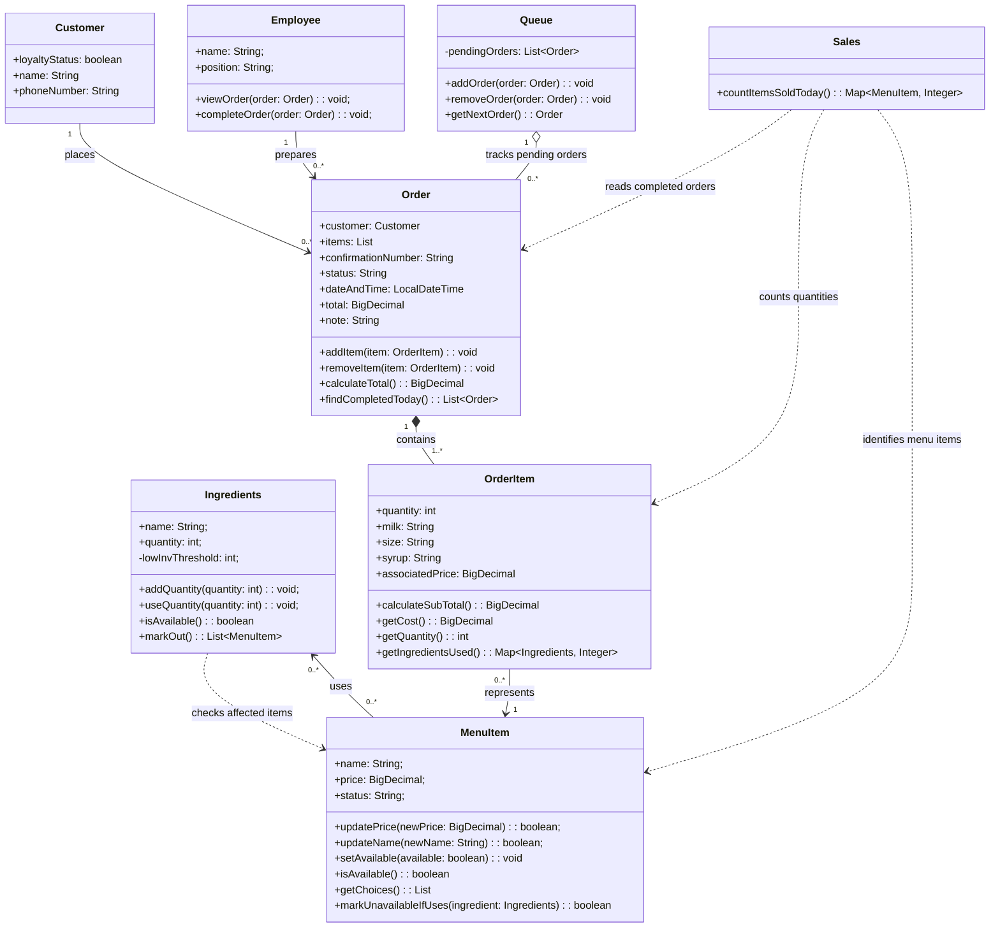

# Group Artifact - Week 7 Round 1
**Group:** 2
**Members present:** Elijah Allotey, Thomas Yang, Abenezer Aregay, Houreratou Bande
**Date:** 10/8/2026

---

# 1. Tonight's Prompt

## Week 7: Group Build
### ICS372 | Object-Oriented Design and Implementation

**30 minutes, then 20 more after the checkpoint.** Commit to `docs/week-07/group-artifact.md`.

## Checklist

Read this aloud in your room and check every box before you commit. **14 of tonight's 20 group points.** The other 6 are in the group redesign.

- [X] Step 1 has a row for each of the six jobs, in order **(3 pts)**
- [X] Every row has exactly one class under **Owner we chose** **(3 pts)**
- [X] Every row says what data the job needs and which class holds it **(3 pts)**
- [X] Step 2 lists every job with no honest owner, or says `- None.` **(1 pt)**
- [X] Sections 2 to 4 of the template say how you got here, where you disagreed, and what you're not sure about **(4 pts)**
- [X] Committed to `docs/week-07/group-artifact.md` **(required: nothing is graded without it)**

Don't change your class diagram yet. The table is your *before*.

---

Each of your sketches made the same kinds of decisions alone: which class answers whether an item can be sold, which class knows a price, which class uses up ingredients. Now you put those decisions side by side and choose **one owner for every job.** Copy the steps below into **section 1 of your group artifact** and put each deliverable under the step that asked for it.

**Groups of three:** spend your first ten minutes drawing UC-4 together, following the rules in the individual sketch handout, and put that diagram under step 1.

**Step 1: The responsibility table.** A table with exactly these seven columns and one row for each of the six jobs below. The example row is from the library and shows only the shape.

| Job | UC-1 | UC-2 | UC-3 | UC-4 | Owner we chose | Data it needs, and the class that holds it |
|---|---|---|---|---|---|---|
| Find a book by its title | `Catalog.findByTitle()` | - | proposed: `Library.search()` | - | `Catalog` | the list of every book: `Catalog` |

The six jobs, in this order:

1. Say whether a menu item can be sold right now
2. Say what an item costs as the customer configured it
3. Say what an item uses up, its customizations included
4. Use up the ingredients for a completed order
5. Know which order is next
6. Count how many of each menu item sold today

| Job | UC-1 | UC-2 | UC-3 | UC-4 | Owner we chose | Data it needs, and the class that holds it |
|---|---|---|---|---|---|---|
| Say whether a menu item can be sold | Employee.createOrder(items: OrderItem[]) | - | - | MenuItem.markUnavailableIfUses(ingredient) | MenuItem | The list of the status of every ingredient & the list of every menu item: 'MenuItem' | 
| Say what an item costs as the customer configured it | Employee.createOrder(items: OrderItem[]) | - | - | - | Employee | the list of associated prices per order item in the created order: 'Employee' |
| Say what an item uses up, its customizations included | Employee.createOrder(items: OrderItem[]) | - | - | - | Order | The list of items that were used with customizations: 'Order' | 
| Use up the ingredients for a completed order | Employee.createOrder(items: OrderItem[]) | Barista.usedOrderIngredients() | - | - | Ingredients | The ingredient quantity used: 'Ingredients' | 
| Know which order is next | - | barista.queueMethods() | - | - | Barista | The list of pending orders in the queue 'Barista' | 
| Count how many of each menu item sold today | - | - | Order.findCompletedToday() OrderItem.getQuantity() MenuItem.getName() | Employee | the list of quantities of each menu item that was used: 'Employee' |

# Week 7: Group Redesign
### ICS372 | Object-Oriented Design and Implementation

**30 minutes.** Same file, second commit: `docs/week-07/group-artifact.md`.

## Checklist

Check every box before you commit. **6 of tonight's 20 group points.**

- [X] Item 1 has a row for every owner you changed, or says `No owner changed.` with one sentence **(2 pts)**
- [X] Item 2's diagram has the method for every owner in your table, with a return type, and renders on GitHub **(3 pts)**
- [X] Item 3 is two or three sentences on what changed **(1 pt)**
- [X] Everything new is under `### After the regroup`, committed to `docs/week-07/group-artifact.md` **(required: nothing is graded without it)**

---

Don't start a new file or delete your first version's work. Put everything new under this heading at the very end of section 1:

### After the regroup

**The five rules from the regroup:**

1. **Actors live outside the system.** A class named after a person holds facts about that person. It doesn't do that person's job.
2. **The class that holds the data a job needs does the job.**
3. **One fact, one owner.** If two classes can answer the same question, sooner or later they'll disagree.
4. **If a relationship has to remember something** (which choices, how many, at what price, when), **the relationship is a class,** and it does the jobs that need what it remembers.
5. **One reason to change.** If a class would have to change for two unrelated reasons, it's two classes, or one of its methods belongs somewhere else.

**1. Re-run your table against the rules.** For every owner you change, one row:

| Job | Owner before | Owner now | Rule that moved it |
|---|---|---|---|
| Say whether a menu item can be sold | MenuItem | No Owner Changed | 2 - MenuItem determines the items availability and uses ingredient availability as support | 
| Say what an item costs as the customer configured it | Employee | OrderItem | 1 & 2 | 
| Say what an item uses up, its customizations included | Order | OrderItem | 2 & 4 |
| Use up the ingredients for a completed order | Ingredients | No owner changed | 2 - Ingredients hold and updates ingredient quantities | 
| Know which order is next | Barista | Queue | 1 & 4 | 
| Count how many of each menu item sold today | Employee | Sales | 1 & 5 |

If no owner changed, write `No owner changed.` and one sentence saying which rule you checked hardest.

**2. The updated class diagram.** Copy the diagram from `docs/design/class-model.md` and change it so every job's owner has the method for that job, with parameters and a return type. Add any class you need, remove any class that lost all its jobs, and connect every class that calls another with a line.

**3. What changed.** Two or three sentences: which class lost the most jobs, which gained the most, and why.

After our regroup, Employee and Barista lost responsibilities because actors shouldn't perform jobs of the system. OrderItem gained responsibilities because it holds the configured item's price and customizations while Queue and Sale was added to handle pending orders and daily sale count.

- **UC-1 through UC-4:** the method that did this job in that person's diagram, written `Class.method()`. If it was a `MISSING` proposal, write `proposed:` before it. If the job doesn't happen in that use case, write a dash.
- **Owner we chose:** exactly one class.
- **Data it needs:** what the job has to know, and which class in your model holds that today.

**Step 2: Jobs with no honest owner.** A job has no honest owner when no class in your model holds the data it needs. One line each:

- `Job: <the job>. It needs: <the data>. No class has it because: <why>.`

None.

---

## 2. How We Got Here

Something we realized as we made our responsibility tables is that classes like employee were getting too many responsibilities. Before the rework, we were forced to use what we had and see the gaps that we left open. By the time we reached rework, we changed four of the six job owners. We created Queue and Sales to help decrease the multiple responsibilities Employee had. We had made it responsible for too much. Dealing with keeping track of orders, being barista, and collecting the data that goes through it. On the other hand, OrderItem, MenuItem, Ingredients, and Order are classes we think do have one job. After regrouping, we recognized that we weren’t using OrderItem for the responsibility it was made for. We had multiple times when we made another class to tell us about orderItem.  Instead of going to the class that knows the customized item and its price.

---

## 3. Where We Disagreed

One valuable disagreement that was resolved was over who should own the price of a customized item. We had it as Employees job before the regroup due to it dealing with orders. After we regrouped, half the group thought that it made more sense for it to be Orders job to know. This was mainly due to it being the class that will list that information, but it was brought up that we are using a class for another class's information. OrderItem holds the information we want, so it would be the class responsible for getting the price of a customized item. This helped with the next job we had to decide on. It was about the ingredients used by a customized item. It made sense that it was a similar situation where we gave OrderItems responsibility to another class and ended up changing it.

---

## 4. What We're Not Sure About

One thing we aren't sure about is how the getIngredientsUsed() method will determine the exact quantities of ingredients needed for different drink sizes and customizations. Our current design stores the item's quantity, size, milk, and syrup but we still need to make sure our model can translate those choices into ingredient quantities. 

Another thing is how will MenuItem handle ingredients becoming unavailable especially when the ingredient is a optional customization. Making an entire menu item unavailable just because an optional syrup is out could prevent customers from ordering drinks that can still be made.

We are leaving these implementation details open because our main focus is assigning responsibilities to the right classes.

